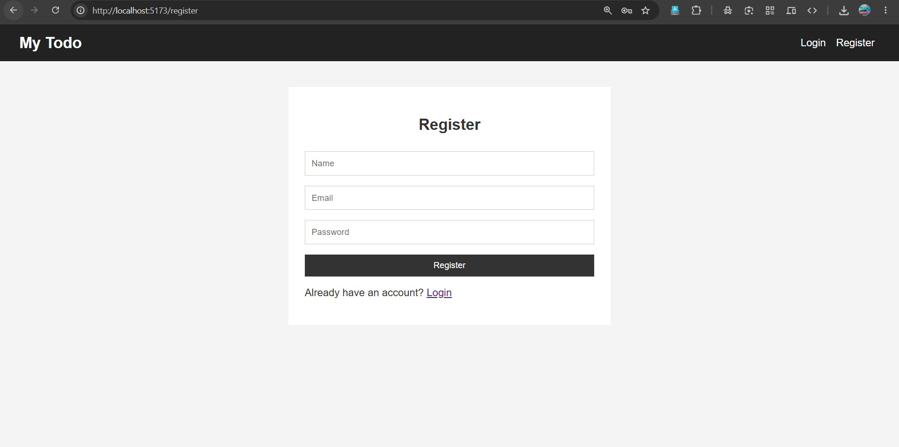
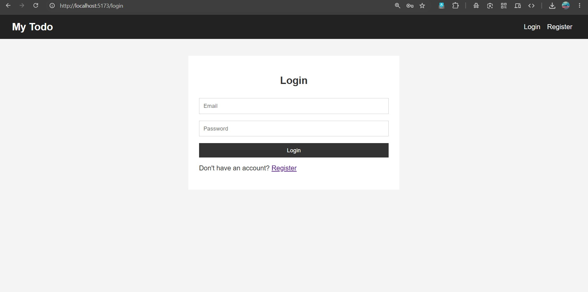
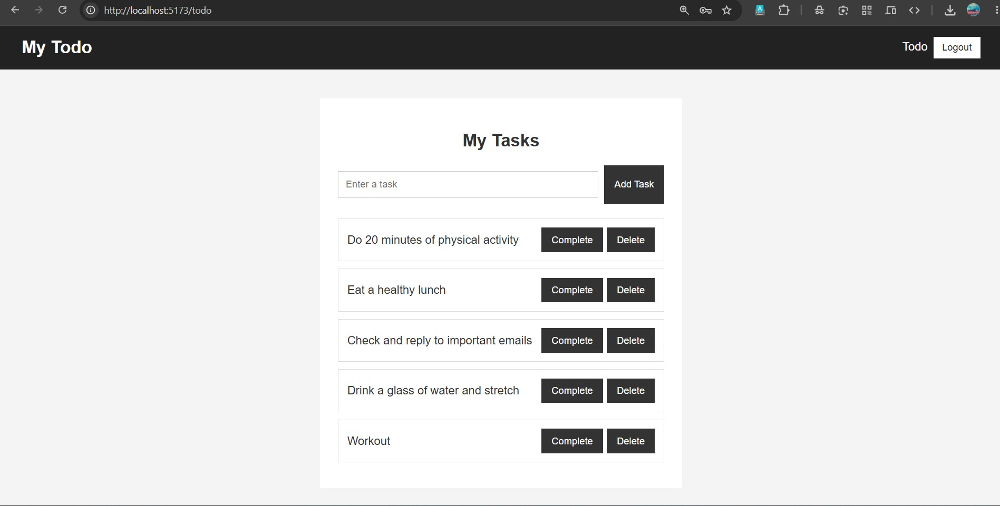
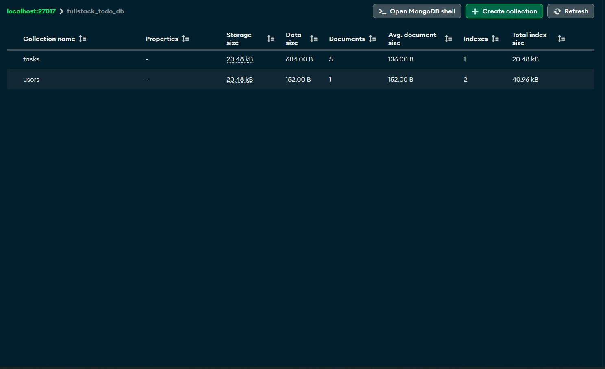

# Phase 3 - Full-Stack Integration

This stage connects the frontend and backend into complete working applications.

The focus is on communication between React and Express, authentication, routing, protected pages and CRUD functionality.

## Full-Stack To-Do Application

A complete To-Do application built by connecting the React frontend with the Express and MongoDB backend.

**Features:**

- User registration
- User login
- JWT authentication
- Protected routes
- Add tasks
- View tasks
- Complete tasks
- Delete tasks
- MongoDB persistence
- React Router
- Context API
- Form validation
- Fetch API integration

## Application Screenshots

