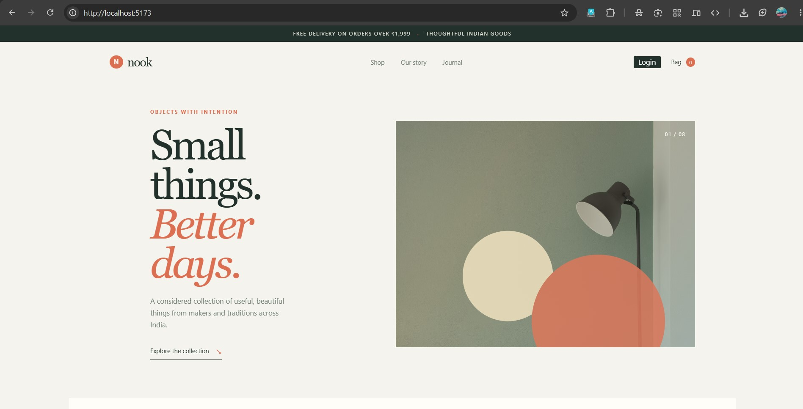
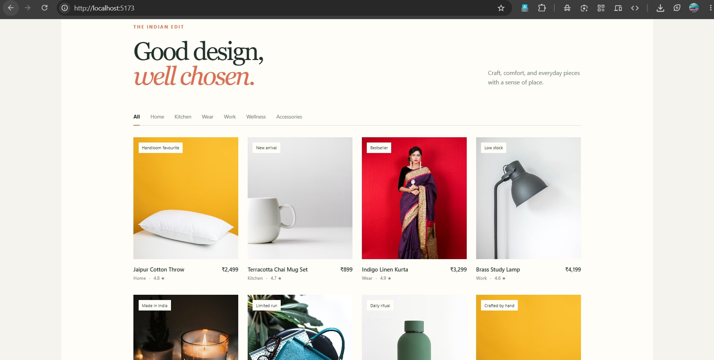
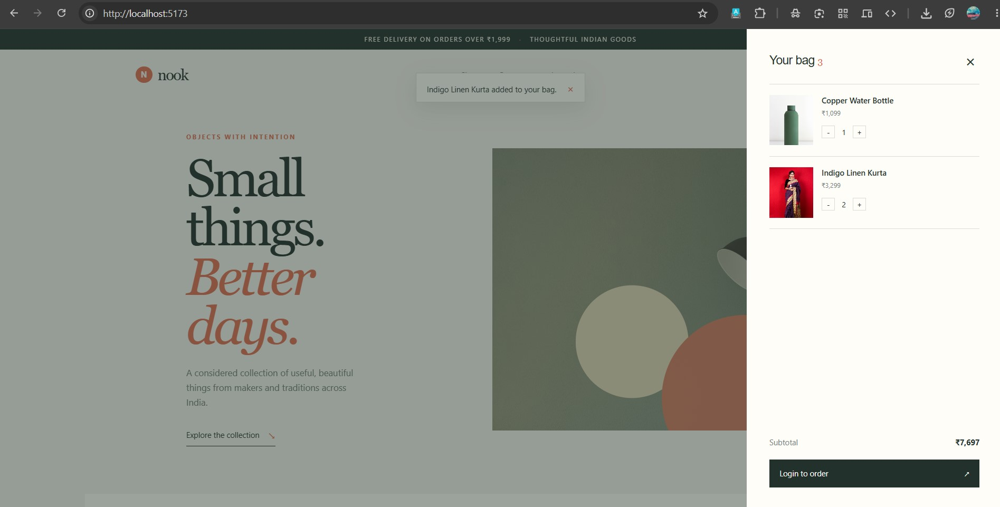
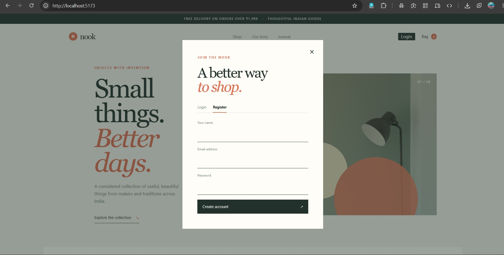

# Phase 4 - Capstone & Application Development

The final stage of the curriculum focuses on advanced React development, API integration, testing, debugging, deployment and documentation.

The capstone stage also introduces production-oriented application development and deployment using platforms such as Vercel, Netlify, Render and MongoDB Atlas.

## Nook - E-Commerce Website

As part of the application development work, I built **Nook**, an e-commerce website interface.

**Implemented areas include:**

- Home page
- Product listing
- Shopping bag/cart
- Authentication interface
- Responsive UI
- Component-based frontend structure

## Nook Screenshots

