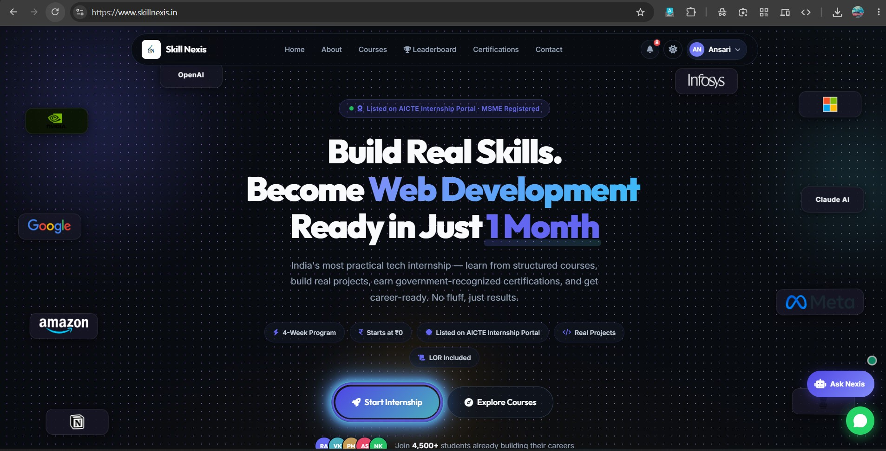

# Full-Stack Web Development Internship



> A practical Full-Stack Web Development internship focused on building real web applications using modern frontend, backend, database, and deployment technologies.

· [Skill Nexis](https://www.skillnexis.in/) 


---

## About the Internship

The **Full-Stack Web Development (MERN) Internship** by **Skill Nexis** is designed around practical learning and project-based development.

Instead of only studying concepts, the internship focuses on applying them through assignments, mini projects, APIs, and complete web applications.

The program covers the complete development process - from writing basic HTML and CSS to building React interfaces, developing REST APIs, connecting MongoDB, implementing authentication, integrating frontend and backend systems, and working toward production-ready applications.

### Program Highlights

- Practical, project-based learning
- Frontend and backend development
- MERN stack technologies
- REST API development
- Authentication and authorization concepts
- Database integration
- Full-stack application development
- Testing and debugging
- Deployment and documentation
- Industry-oriented projects

**Program:** Full-Stack Web Development (MERN)  
**Duration:** 6 Months  
**Organization:** Skill Nexis  
**Website:** https://www.skillnexis.in/

> Listed on the AICTE Internship Portal · MSME Registered

---

# What I Am Learning

Throughout the internship, I am working across different areas of modern web development.

### Frontend Development

- HTML5 semantic structure
- CSS3
- Flexbox and Grid
- Responsive web design
- JavaScript ES6+
- React.js
- Components
- Props
- State
- Events
- Dynamic rendering
- React Router
- Context API

### Backend Development

- Node.js
- NPM
- Express.js
- Routing
- REST APIs
- MongoDB
- Mongoose
- CRUD operations
- JWT authentication
- Password hashing with bcrypt

### Full-Stack Development

- Connecting React with Express
- Fetch API / Axios
- Authentication flow
- Protected routes
- State management
- Form validation
- File uploads with Multer
- Frontend and backend integration

### Deployment & Project Development

- Application testing
- Debugging
- API testing with Postman
- Cloud deployment
- MongoDB Atlas
- Vercel
- Netlify
- Render
- Project documentation and presentation

---

# Practical Work

The repository is organized around the major stages of the internship rather than individual Phases.

---

## Phase 1 - Frontend Foundations

The first stage focuses on building a strong foundation in HTML, CSS, JavaScript and React.

The work includes responsive layouts, semantic HTML, CSS layouts, JavaScript functionality and reusable React components.

### Personal Portfolio Website

A basic responsive personal portfolio created using HTML and CSS.

**Sections included:**

- About
- Education
- Projects
- Contact

### JavaScript Form Validation

A simple form validation implementation using JavaScript to handle user input and validate form fields.

### React Components Practice

A React project focused on understanding reusable components and component-based development.

**Components created:**

- Header
- Footer
- Card
- Button
- Form

The project also demonstrates:

- Props
- State
- Events
- Dynamic rendering


### React Blog UI

A small React-based blog interface where posts are loaded from a JSON file.

**Features:**

- Post cards
- Search functionality
- Category filtering
- Dynamic rendering
- Responsive layout


---

## Phase 2 - Backend & API Development

The next stage focuses on server-side development using Node.js, Express.js and MongoDB.

The projects introduce REST API design, database operations and user authentication.

### To-Do List REST API

A REST API for managing tasks using Express.js, MongoDB and Mongoose.

**Features:**

- Create tasks
- Read tasks
- Update tasks
- Delete tasks
- MongoDB data storage
- REST API endpoints
- Postman testing

### API Testing

The API was tested using Postman.

[View Postman Request](https://www.postman.com/full-stack-web-dev-mern-internship/workspace/skill-nexis/request/19028809-30f127fa-c44e-43a9-b767-fad79cd79509?action=share&creator=19028809)


### User Authentication API

A backend authentication API implementing user registration and login.

**Features:**

- User registration
- User login
- Password hashing with bcrypt
- JWT token generation
- Protected API route
- Authentication validation

[View Authentication API](https://www.postman.com/full-stack-web-dev-mern-internship/workspace/skill-nexis/request/19028809-30f127fa-c44e-43a9-b767-fad79cd79509?action=share&creator=19028809)


### MongoDB

MongoDB was used as the database for storing application data.


---

## Phase 3 - Full-Stack Integration

This stage connects the frontend and backend into complete working applications.

The focus is on communication between React and Express, authentication, routing, protected pages and CRUD functionality.

### Full-Stack To-Do Application

A complete To-Do application built by connecting the React frontend with the Express and MongoDB backend.

**Features:**

- User registration
- User login
- JWT authentication
- Protected routes
- Add tasks
- View tasks
- Complete tasks
- Delete tasks
- MongoDB persistence
- React Router
- Context API
- Form validation
- Fetch API integration

### Application Screenshots


---

## Phase 4 - Capstone & Application Development

The final stage of the curriculum focuses on advanced React development, API integration, testing, debugging, deployment and documentation.

The capstone stage also introduces production-oriented application development and deployment using platforms such as Vercel, Netlify, Render and MongoDB Atlas.

### Nook - E-Commerce Website

As part of the application development work, I built **Nook**, an e-commerce website interface.

**Implemented areas include:**

- Home page
- Product listing
- Shopping bag/cart
- Authentication interface
- Responsive UI
- Component-based frontend structure

### Nook Screenshots


---

# Technology Stack

| Area | Technologies |
|---|---|
| Markup | HTML5 |
| Styling | CSS3 |
| Programming | JavaScript ES6+ |
| Frontend | React.js |
| Routing | React Router |
| State Management | Context API |
| Backend | Node.js |
| Server | Express.js |
| Database | MongoDB |
| ODM | Mongoose |
| Authentication | JWT |
| Password Security | bcrypt |
| API Testing | Postman |
| File Upload | Multer |
| Package Manager | NPM / pnpm |
| Deployment | Vercel, Netlify, Render, MongoDB Atlas |

---

# Skills Practiced

Through the projects in this repository, I have practiced:

- Building responsive web pages
- Writing reusable React components
- Managing component state
- Passing data using props
- Rendering data dynamically
- Working with JSON data
- Building REST APIs
- Performing CRUD operations
- Working with MongoDB and Mongoose
- Implementing user authentication
- Hashing passwords
- Working with JWT tokens
- Creating protected routes
- Connecting frontend and backend applications
- Sending API requests using Fetch
- Handling forms and validation
- Testing APIs with Postman
- Debugging full-stack applications
- Building complete web applications

---

# Repository Structure

```text
skill-nexis-internship-work/
├───Phase-1
│   ├───assignment-1
│   ├───assignment-2
│   │   └───react-component-practice
│   │       ├───public
│   │       └───src
│   │           ├───assets
│   │           └───components
│   ├───mini-project
│   │   └───react-blog-mini-project
│   │       ├───public
│   │       └───src
│   │           ├───assets
│   │           ├───components
│   │           └───data
│   ├───practice-questions
│   └───Screenshots
├───Phase-2
│   ├───assignment-1
│   │   ├───Todo-Postman
│   │   └───todo-rest-api
│   │       ├───models
│   │       └───routes
│   └───assignment-2
│       ├───user-auth-api
│       │   ├───models
│       │   └───routes
│       └───User-Auth-Postman
├───Phase-3
│   ├───assignment-1-fullstack-todo
│   │   ├───backend
│   │   │   ├───middleware
│   │   │   ├───models
│   │   │   └───routes
│   │   └───frontend
│   │       ├───public
│   │       └───src
│   │           ├───assets
│   │           ├───components
│   │           ├───context
│   │           └───pages
│   └───assignment-1-Screenshots
└───Phase-4
    ├───backend
    ├───frontend
    └───ScreenShots
```